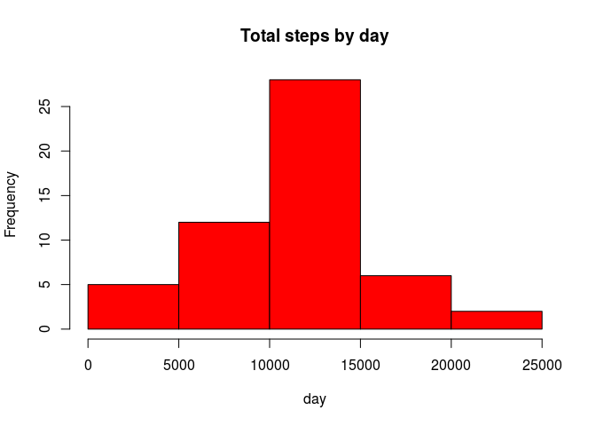
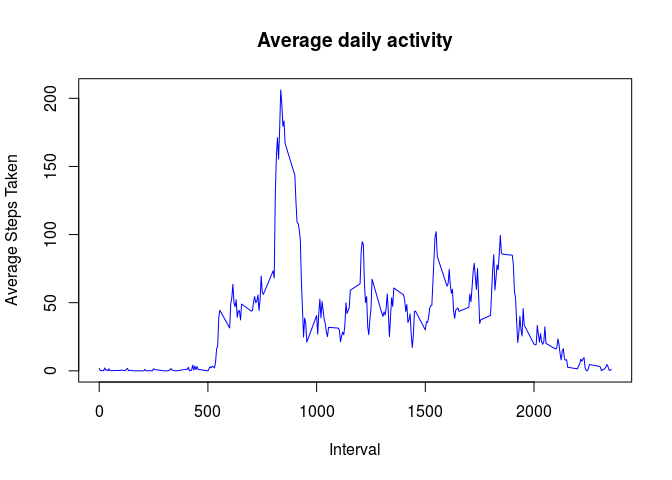
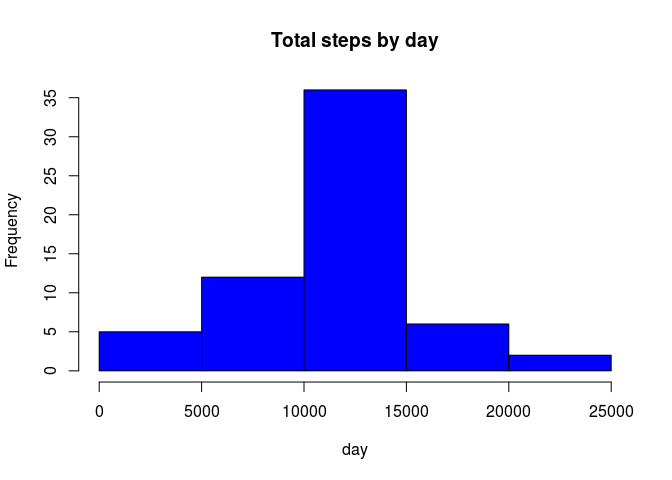
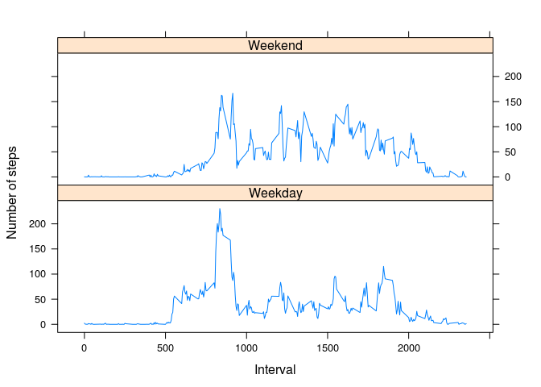

# Reproducible Research: Peer Assessment 1


## Loading and preprocessing the data
Load the data into data frame $data$

```r
data <- read.csv("activity.csv", colClasses = c("numeric", "character",
                                                "numeric"))
head(data)
```

```
##   steps       date interval
## 1    NA 2012-10-01        0
## 2    NA 2012-10-01        5
## 3    NA 2012-10-01       10
## 4    NA 2012-10-01       15
## 5    NA 2012-10-01       20
## 6    NA 2012-10-01       25
```
Transform date into suitable format

```r
data$date <- as.Date(data$date, "%Y-%m-%d")
```
## What is mean total number of steps taken per day?
Create a data frame with days and total steps by day

```r
df <- aggregate(steps ~ date, data = data, sum, na.rm = TRUE)
head(df)
```

```
##         date steps
## 1 2012-10-02   126
## 2 2012-10-03 11352
## 3 2012-10-04 12116
## 4 2012-10-05 13294
## 5 2012-10-06 15420
## 6 2012-10-07 11015
```
Generating a historgram

```r
hist(df$steps, main = "Total steps by day", xlab = "day", col = "red")
```

 

Mean :

```r
mean(df$steps)
```

```
## [1] 10766.19
```
Median :

```r
median(df$steps)
```

```
## [1] 10765
```
## What is the average daily activity pattern?
Getting mean of steps and time series plot

```r
ave_step <- aggregate(steps ~ interval, data, mean)
```
Plotting :

```r
plot(ave_step$interval, ave_step$steps, type = "l", xlab = "Interval",
     ylab = "Average Steps Taken", main = "Average daily activity",
     col = "blue")
```

 
Interval with maximum no. of steps :

```r
max_interval <- ave_step[which.max(ave_step$steps), 1]
max_interval
```

```
## [1] 835
```
## Imputing missing values
Report the number of missing values in dataset

```r
data_na <- sum(!complete.cases(data))
data_na
```

```
## [1] 2304
```
Filling out NA(s) with the mean for the 5-minute interval

```r
StepsAverage <- aggregate(steps ~ interval, data = data, FUN = mean)
fillNA <- numeric()
for (i in 1:nrow(data)) {
    obs <- data[i, ]
    if (is.na(obs$steps)) {
        steps <- subset(StepsAverage, interval == obs$interval)$steps
    } else {
        steps <- obs$steps
    }
    fillNA <- c(fillNA, steps)
}
```
Create a new data set

```r
data_new <- data
data_new$steps <- fillNA
```
Creating new histogram

```r
totalSteps_new <- aggregate(steps~date, data = data_new, sum, na.rm=T)
hist(totalSteps_new$steps, main = "Total steps by day", xlab = "day",
     col = "blue")
```

 

New _Mean_ :

```r
mean(totalSteps_new$steps)
```

```
## [1] 10766.19
```
This is the same as previous result

New _Median_ :

```r
median(totalSteps_new$steps)
```

```
## [1] 10766.19
```
This value is slightly different.

## Are there differences in activity patterns between weekdays and weekends?
Creating a new factor variable with two levels : $Weekday$ , $Weekend$.

```r
day <- weekdays(data_new$date)
daytype <- vector()

for (i in 1:nrow(data_new)) {
    if (day[i] == "Saturday") {
        daytype[i] <- "Weekend"
    } else if (day[i] == "Sunday") {
        daytype[i] <- "Weekend"
    } else {
        daytype[i] <- "Weekday"
    }
}

data_new$daytype <- daytype
data_new$daytype <- factor(data_new$daytype)

steps_day <- aggregate(steps ~ interval+daytype, data_new , mean)
names(steps_day) <- c("interval", "daytype", "steps")
```
Loading the lattice library

```r
library(lattice)
```
Panel Plot :

```r
xyplot(steps ~ interval | daytype, steps_day, type = "l", layout = c(1, 2),
        xlab = "Interval", ylab = "Number of steps")
```

 
